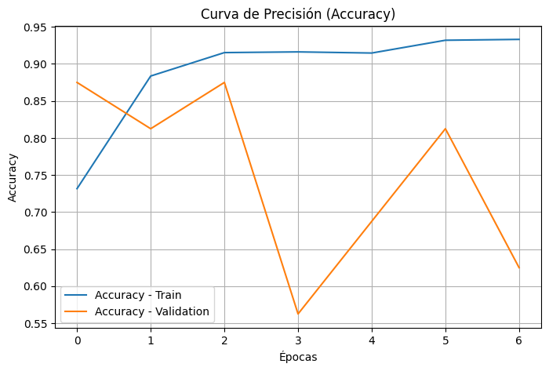
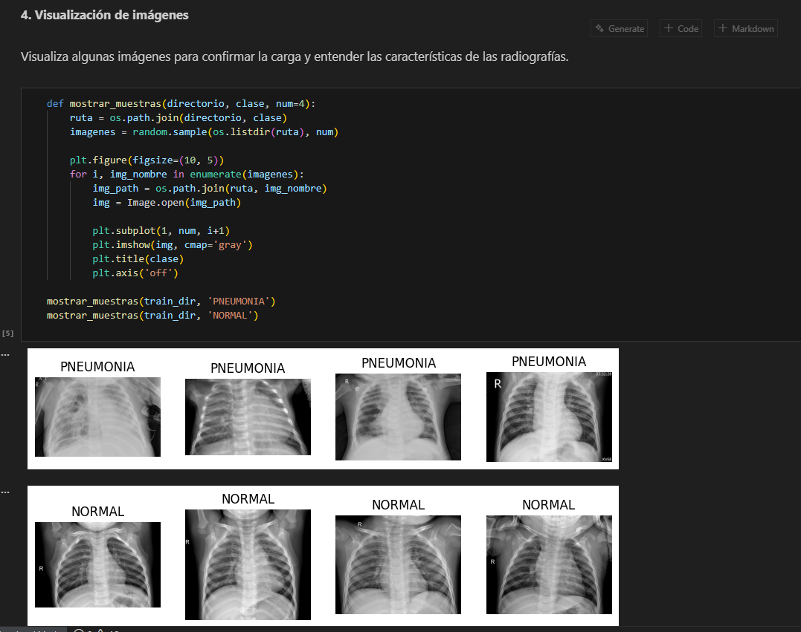
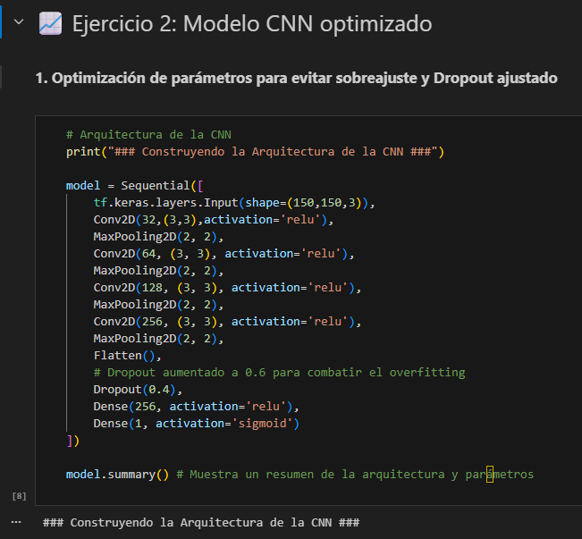
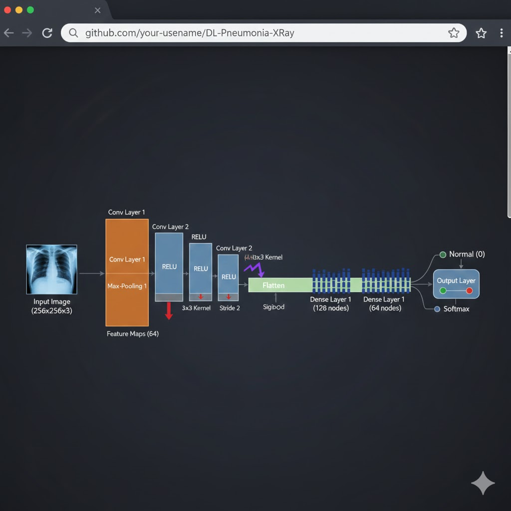

# Medical Diagnosis via Deep Learning | Chest X-Ray Classification

## 📌 Project Overview
This project focuses on assisting medical professionals by automating the detection of pneumonia in pediatric chest X-ray images. Using a dataset of over 5,863 images, I developed a **Convolutional Neural Network (CNN)** to prioritize urgent cases in high-volume clinical environments.

## 🧠 Model Architecture (CNN)
The model was built using **TensorFlow and Keras**, featuring:
- **Convolutional Layers:** To extract spatial features from the X-rays.
- **Pooling Layers:** To reduce dimensionality while retaining key information.
- **Dense Layers:** For final classification into 'Normal' or 'Pneumonia'.
- **Dropout:** Applied to prevent overfitting and improve model robustness.

## 📈 Model Performance
The model achieved an accuracy of **82.37%** on the validation set. Below are the training curves and evaluation metrics:

### 1. Training vs. Validation (Accuracy & Loss)

### 2. Images

### 3. CNN Architecture

### 4. Diagram - CNN

## 📊 Performance & Results
- **Target:** >80% Accuracy.
- **Outcome:** The model successfully met the threshold, showing a strong ability to generalize on previously unseen data (Validation Set).
- **Metric Insights:** High **Recall** was prioritized to minimize "False Negatives," which is critical in a medical context (ensuring no sick patient is sent home).

## 📈 Key Visualizations
In the notebook, you will find:
1. **Sample X-rays:** Visual exploration of the differences between a healthy lung and one with pneumonia.
2. **Learning Curves:** Step-by-step visualization of the training process.
3. **Confusion Matrix:** Detailed breakdown of correct and incorrect predictions.

## 📂 Repository Structure
- `/notebooks`: `M7_Marcel_Palma_Opcional_CNN.ipynb` (Model training and evaluation).
- `/docs`: Business context and medical requirements.
*(Note: The raw image dataset is not included due to size constraints - 3.46 GB).*

## 🚀 Technologies Used
- **Python**
- **TensorFlow / Keras**
- **OpenCV / Matplotlib** (Image processing & visualization)

## 📊 Dataset Source
The model was trained using the "Chest X-Ray Images (Pneumonia)" dataset from Kaggle. 
- **Total Images:** 5,863 JPEGs.
- **Categories:** Binary (Normal / Pneumonia).
- **Patient Cohort:** Pediatric patients (1-5 years old).

🔗 **Direct Link:** [Kaggle Dataset - Chest X-Ray Pneumonia](https://www.kaggle.com/datasets/paultimothymooney/chest-xray-pneumonia/data)

> **Note:** Due to the large size of the dataset (3.46 GB), images are not stored in this repository. Follow the link above to download the raw data for reproduction.
